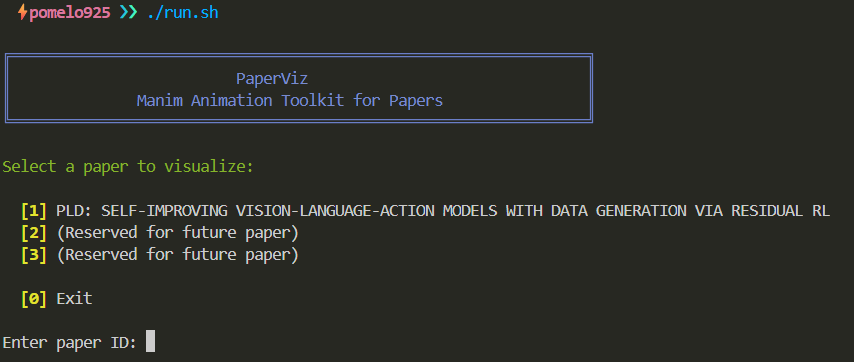

<div align="center">

# PaperViz

<p align="center">
  <strong>A Manim-based Animation Toolkit for Visualizing Research Papers</strong>
</p>

[![Contributors][contributors-shield]][contributors-url]
[![Forks][forks-shield]][forks-url]
[![Stargazers][stars-shield]][stars-url]
[![Issues][issues-shield]][issues-url]
[![MIT License][license-shield]][license-url]

</div>

</br>

<div align="center">

## 📖 About The Project

</div>

**PaperViz** is a personal project that brings robotics research papers to life through animation. Using [Manim Community Edition](https://www.manim.community/), I create educational videos that break down complex algorithms and architectures into easy-to-understand visual stories.

I hope to make cutting-edge robotics research accessible and enjoyable for everyone curious about the field!

</br>

<div align="center">

## 🚀 Getting Started

</div>

### Prerequisites

Ensure you have the following installed:

- **Docker & Docker Compose**: Required for containerized rendering
- **Git**: For version control
- **Bash**: For running the main script

### Installation

1. Clone the repository:

   ```bash
   git clone https://github.com/pomelo925/PaperViz.git
   cd PaperViz
   ```

2. Make the run script executable:

   ```bash
   chmod +x run.sh
   ```

</br>

<div align="center">

## 🎯 Usage

</div>

PaperViz provides two ways to render animations:

### A. Interactive Mode

Simply run the script without arguments to see an interactive menu:

```bash
./run.sh
```

You'll see a menu like this:

<div align="center">
  
</div>

</br>

### B. Direct Mode

Render a specific paper directly by providing its ID:

```bash
./run.sh 1    # Renders Paper ID 1 (PLD)
```

### Output

After rendering, the animation video will be saved to:

```
workspace/media/videos/<scene_name>/<quality>/
```

</br>

<div align="center">

## 📚 Available Papers

</div>

| ID | Paper Title | Status | Script |
|----|-------------|--------|--------|
| 1  | *PLD: SELF-IMPROVING VISION-LANGUAGE-ACTION MODELS WITH DATA GENERATION VIA RESIDUAL RL* | 🚧 In Progress | [View Article](https://www.wenlixiao.com/self-improve-VLA-PLD) |
| 2  | *(Reserved for future paper)* | 🔜 Coming Soon | - |
| 3  | *(Reserved for future paper)* | 🔜 Coming Soon | - |

</br>
<div align="center">

## 🛠️ Technical Details

</div>

### Docker Image

The Docker image includes:

- **Base**: Ubuntu 22.04
- **Python**: Python 3 with pip
- **Manim**: Manim Community Edition
- **FFmpeg**: For video rendering
- **LaTeX**: For mathematical typesetting (texlive-full)
- **Scientific Libraries**: NumPy, SciPy, Matplotlib

### Manim Quality Options

- `-ql`: Low quality (854x480, 15fps) - Fast preview
- `-qm`: Medium quality (1280x720, 30fps)
- `-qh`: High quality (1920x1080, 60fps)
- `-qk`: 4K quality (3840x2160, 60fps)

### Flags

- `-p`: Preview after rendering
- `-s`: Save last frame as image
- `-i`: Show file in finder after rendering

</br>

<div align="center">

## 📝 License

</div>

Distributed under the MIT License. See `LICENSE` for more information.

</br>

<div align="center">

## 🙏 Acknowledgments

</div>

- [Manim Community Edition](https://www.manim.community/) - The animation engine
- All paper authors whose work we visualize
- Contributors to this project

</br>

<div align="center">

## Contributors

<a href="https://github.com/pomelo925/PaperViz/graphs/contributors">
  
</a>

</div>


<!-- MARKDOWN LINKS & IMAGES -->
[contributors-shield]: https://img.shields.io/github/contributors/pomelo925/PaperViz.svg?style=for-the-badge
[contributors-url]: https://github.com/pomelo925/PaperViz/graphs/contributors
[forks-shield]: https://img.shields.io/github/forks/pomelo925/PaperViz.svg?style=for-the-badge
[forks-url]: https://github.com/pomelo925/PaperViz/network/members
[stars-shield]: https://img.shields.io/github/stars/pomelo925/PaperViz.svg?style=for-the-badge
[stars-url]: https://github.com/pomelo925/PaperViz/stargazers
[issues-shield]: https://img.shields.io/github/issues/pomelo925/PaperViz.svg?style=for-the-badge
[issues-url]: https://github.com/pomelo925/PaperViz/issues
[license-shield]: https://img.shields.io/github/license/pomelo925/PaperViz.svg?style=for-the-badge
[license-url]: https://github.com/pomelo925/PaperViz/blob/main/LICENSE
